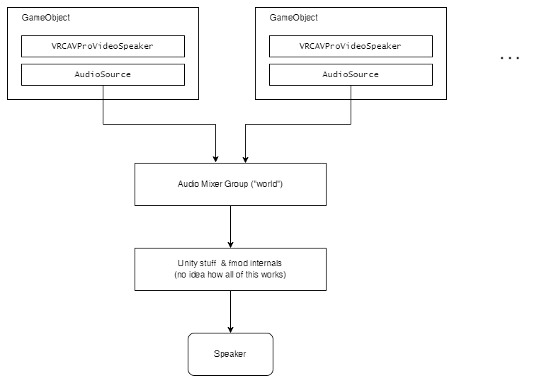
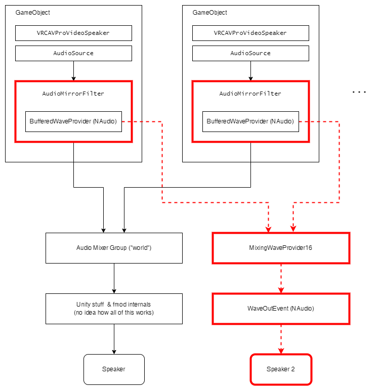
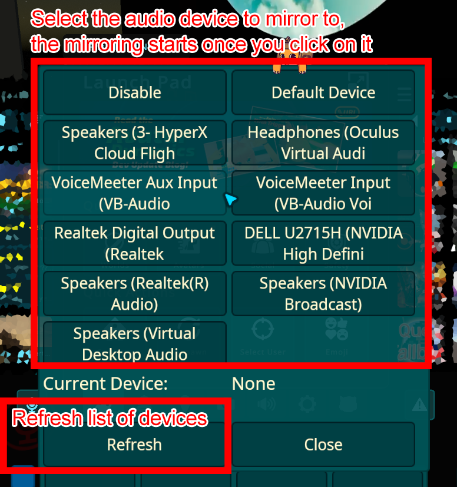
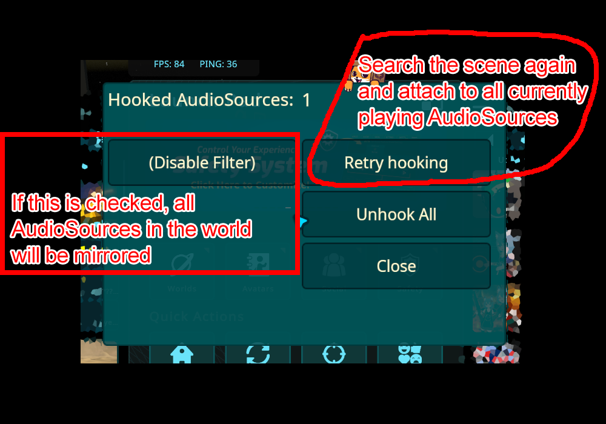

# VRChat Media Audio Mirror

A mod for VRChat that redirects audio from AudioSources attached to media players in worlds to another output device at full volume.
The main purpose of this mod (for me) was to make my Woojer Vest finally usable in VRChat, but you could also use this to only play the music in your room on other speakers while still having all sounds including voices inside the headset.

## Installation

0. Have MelonLoader 0.5 or later installed.

1. Install UiExpansionKit, for example by using [VRCMelonAssistant](https://github.com/knah/VRCMelonAssistant).

2. Go to the [releases](https://github.com/jangxx/VRCMediaAudioMirror/releases) section and download the latest release.

3. Put NAudio.dll from _UserLibs/_ into the _UserLibs/_ folder within the VRChat directory.

4. Put MediaAudioMirror.dll into the _Mods/_ folder within the VRChat directory.

## Working principle

Normally, the audio from a media players traverses Unity something like this:

The mod injects a custom audio filter into each GameObject that has a media player and captures the audio directly in `OnAudioFilterRead`.
This also means that the extraction happens directly in the audio thread and is therefore not subject to glitches caused by a changing framerate or other stuttering.
From there it is fed into a `BufferedWaveProvider`, aggregated in a custom `MixingWaveProvider` and then sent out to the other speaker.
This whole pipeline adds almost zero delay, since the audio samples enter it even before they are seen by the rest of the Unity audio system.
The filter is also responsible for the optional delay feature, which is accomplished by simply storing a number of audio samples in a ringbuffer.
Because the filter is executed before Unity processes the audio, this kind of delaying is possible. 

## Usage

The mod puts two button into the quick menu **Audio Mirror Setup** and **Audio Mirror Status**.

### Audio Mirror Setup

This is the main menu that you use to access the functionality of the mod.
You simply click on the name of an audio device and that immediately starts sending audio to that device.
Once you click on another one, the output will be switched over.

### Audio Mirror Status

This is an additional menu that you can open in case things don't work as well they should.
At the top you can see the number of AudioSources that are currently mirrored.
If the number is zero you can try clicking on *Retry hooking*.
Normally the mod will check the world for media players for the first 30 seconds after joining the world, but if a player gets created even later than that, a manual search can be required.

If the number is still 0 and no audio is playing you can try the nuclear option by checking _(Disable Filter)_.
This will make the *Retry hooking* button look for all AudioSources in the world that are playing (`isPlaying = true`) and that are feeding audio into the world mixer (i.e. they are controlled by the world volume slider).
These can (and probably will) include AudioSources that are not media players but sound effects for example though, so disabling this filter should really only be a last ditch attempt if everything else fails.

Finally, the _Unhook All_ button can be used to reset all attached filters in case you're not happy with the results of the _Retry hooking_ function.

## Settings

The mod only has a few settings:

- **Volume**: As the name implies, this sets the output volume of the mod to the selected output device from 0.0 to 1.0. This setting does not bypass the volume set in Windows for the audio device, so make sure to set that to an appropriate value as well.

- **Added delay to non mirrored audio**: Setting this to anything higher than 0 will add a delay within the audio filter that is applied after the audio is mirrored. This effectively allows you to have the mirrored audio device receive audio earlier than the rest of the game. Do note however that this has no effect on video, so if you use this option the audio played in-game will not be in sync with a video from the same player anymore.